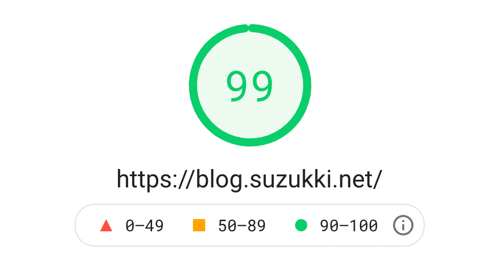

Gatsby+Minimal Blog+Gatsby Cloudで高速でブログを構築・公開する手順の後編です。前編は[こちら](https://blog.suzukki.net/create-blog-by-gatsby)

### 基本設定
[Minimal Blogのドキュメント](https://github.com/LekoArts/gatsby-themes/tree/master/themes/gatsby-theme-minimal-blog#readme)を参考に、基本的な設定を行います。

まず、ヘッダーに表示される内容を編集します。Twitterなどの情報を自分のものに置き換えましょう。以下は当ブログの例です。
```js:title=gatsby-config.js
        externalLinks: [
          {
            name: `Twitter`,
            url: `https://twitter.com/gam_esz`,
          },
          {
            name: `GitHub`,
            url: `https://github.com/suzuki764`,
          },
        ],
```

次に、サイト情報を編集します。サイトの様々な場所で使われる情報をここで一元的に管理することができます。
```js:title=gatsby-config.js
  siteMetadata: {
    // Used for the title template on pages other than the index site
    siteTitle: `すずきのブログ`,
    // Default title of the page
    siteTitleAlt: `すずきのブログ - A blog of information engineering student`,
    // Can be used for e.g. JSONLD
    siteHeadline: `すずきのブログ`,
    // Will be used to generate absolute URLs for og:image etc.
    siteUrl: `https://blog.suzukki.net`,
    // Used for SEO
    siteDescription: `VRの研究室に入ったはずが、気がついたら機械学習をやることになっていた大学生のブログ。`,
    // Will be set on the <html /> tag
    siteLanguage: `ja`,
    // Used for og:image and must be placed inside the `static` folder
    siteImage: `/banner.jpg`,
    // Twitter Handle
    author: `@gam_esz`,
  },
```

`static/robots.txt`を編集します。初めから内蔵されているgatsby-plugin-sitemapというプラグインでは`/sitemap/sitemap-index.xml`にサイトマップが生成されるようです。
```txt:title=robots.txt
sitemap: https://blog.suzukki.net/sitemap/sitemap-index.xml
```

### サンプルページの置き換え
続いて、あらかじめサンプルの内容が入っている部分を置き換えていきましょう。

`content/pages/about/index.mdx`を編集して、Aboutページを編集できます。

`src/@lekoarts/gatsby-theme-minimal-blog/texts/hero.mdx`を作成することで、トップページに表示される内容を編集できます。

また、`src/@lekoarts/gatsby-theme-minimal-blog/texts/bottom.mdx`を作成することで、トップページ下部に表示される内容を編集できます。

### 記事の追加
記事は`content/posts/`に追加することで作成できます。

あらかじめサンプル記事がいくつか入っているので、構成を真似して記事を追加してみましょう。

### 更新を反映
更新を反映させるには、GitHubにプッシュするだけです！

Gatsby Cloudが自動で変更を検出して、ビルドし直してくれます。

### 終わりに
Gatsby+Minimal Blog+Gatsby Cloudという構成で、高速にブログを構築・公開することができました。

私の場合は１時間足らずでここまで完了することができました。

さて、この記事は「Gatsbyで高速ブログ構築・公開！」というタイトルでしたが、実はこの方法、構築が高速なだけでなく、出来上がったブログ自体も高速なんです！

これは当ブログを[PageSpeed Insights](https://developers.google.com/speed/pagespeed/insights/)というサイトのパフォーマンスを測定するサービスで計測した結果です。かなりいい点数が取れていますね。



というわけで、記事タイトルの伏線回収もできたところで（？）この記事はおしまいです。

---
##### 参考
- https://github.com/LekoArts/gatsby-themes/tree/master/themes/gatsby-theme-minimal-blog#readme
- https://www.gatsbyjs.com/plugins/gatsby-plugin-sitemap/